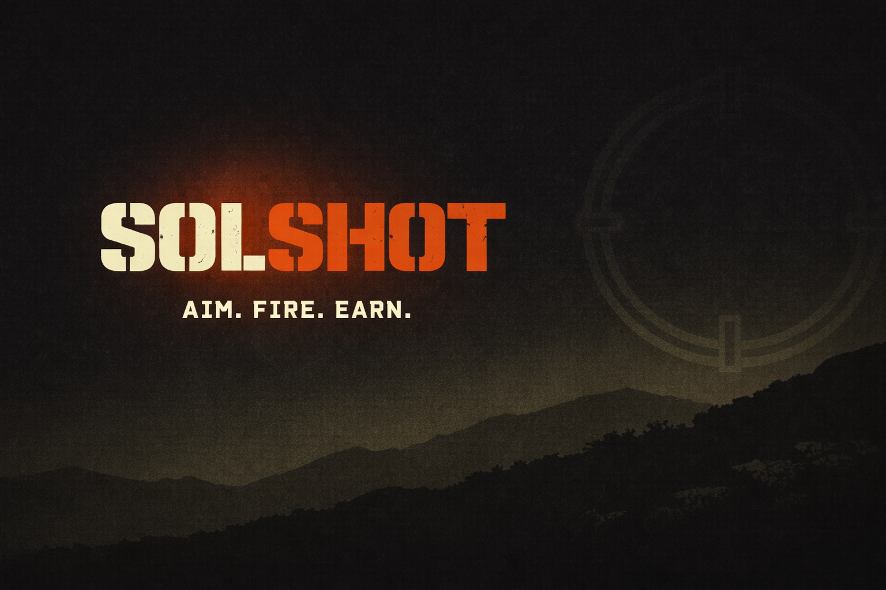

# SolShot

**Artillery duels in your group chat.** Wager SOL, take turns over hours or days, settle on-chain. Pocket Tanks for the era of Telegram-native crypto.

[](https://solshot.gg) [](https://t.me/SolShotGG_bot) [](https://solscan.io/account/BVKXLUnukU9cyTAWojsQPfLWHq4CyJY7CLG59bBVSG7N?cluster=devnet) [](LICENSE)

<p align="center">
  
</p>

## Try it

| | |
|---|---|
| **Web** | [solshot.gg](https://solshot.gg) |
| **Telegram** | DM [@SolShotGG_bot](https://t.me/SolShotGG_bot), send `/play` to bind a wallet, then `/customgame` in any group chat to host a wagered match |
| **iPhone** | Open solshot.gg in Safari, tap Share, then Add to Home Screen for fullscreen |
| **Network** | Devnet today. Mainnet pending escrow audit. |

## What it is

A multiplayer artillery game that lives inside Telegram group chats. Two to ten players take turns firing shots over a chat-paced cadence (12-hour turn timer by default, async multi-day matches), wagering SOL on the outcome. Every shot posts as a chat message. The contract pays the last tank standing.

Two on-chain programs cover the wagering surface:

- **`solshot-escrow` (v1)**: 1v1 wagered duels, real-time pace. Quick Match, Duel, High Roller, Custom Challenge.
- **`solshot-escrow-v2` (v2)**: N-player wagered group-chat matches, async pace, hosted from any Telegram group with `/customgame`.

Both settle pots atomically with a 90/7/3 split (winner, treasury, ops). All split values are fixed in the contract. No off-chain accounting.

## Vision

SolShot today is artillery in a Telegram group chat. Tomorrow it's the **social-game layer for crypto group chats** - multiple games on one shared on-chain economy, deployed across Telegram, Seekr Mobile, iMessage, and WhatsApp, with an open SDK so other devs can ship group-chat-native wagered games on the same infrastructure.

Artillery is the wedge. Group-chat-native gaming is the prize. The group chat is the distribution. The game has to hold up on its own merit.

See the full forward-looking plan in [`Docs/ROADMAP.md`](Docs/ROADMAP.md) (5 phases, principles, multi-game time-windowed wager mechanic), or the [litepaper](Docs/SolShot_Litepaper_v2.2.md) and [SHOT token model](Docs/SHOT_TOKEN_MODEL.md) for the full spec.

## 📚 Documentation

Start here, in order of depth:

| Doc | Purpose | Time |
|---|---|---|
| [`Docs/one-pager.md`](Docs/one-pager.md) | The 90-second pitch | 2 min |
| [`Docs/how-to-play.md`](Docs/how-to-play.md) | Player guide - every match type, every weapon | 10 min |
| [`Docs/ROADMAP.md`](Docs/ROADMAP.md) | Forward-looking plan - 5 phases, multi-platform expansion, open-SDK end state | 5 min |
| [`Docs/SolShot_Litepaper_v2.2.md`](Docs/SolShot_Litepaper_v2.2.md) | Full project spec - vision, distribution, on-chain programs, security posture | 20 min |
| [`Docs/SHOT_TOKEN_MODEL.md`](Docs/SHOT_TOKEN_MODEL.md) | SHOT token model - distribution, emissions, burns, scarcity analysis | 10 min |

### Audit posture

SolShot is an AI-augmented build. Claude Code wrote most of the implementation under direct engineering supervision. Because the codebase moved fast, we ran three independent adversarial audits before submission. Two fix bundles have shipped to `main`. Every finding is documented with a disposition.

We ran three audit pipelines from the [Solana Vibes Kit](https://github.com/MetalegBob) before submission. All reports are in this repo:

| Audit | Scope | Report |
|---|---|---|
| **SOS** | On-chain Anchor programs (vulnerability surface) | [`.audit/FINAL_REPORT.md`](.audit/FINAL_REPORT.md) |
| **BOK** | Math invariants (settlement, fees, refunds) - 159 verification tests passing | [`.bok/reports/`](.bok/reports/) |
| **DB** | Off-chain server (auth, signing, Privy integration) | [`.bulwark/FINAL_REPORT.md`](.bulwark/FINAL_REPORT.md) |

Top-line summary: [`Docs/audit-summary.md`](Docs/audit-summary.md). Mainnet remediation roadmap: [`Docs/mainnet-roadmap.md`](Docs/mainnet-roadmap.md).

### Blog drafts

Marketing copy ready for publication: [`Docs/blog/`](Docs/blog/) - what SolShot is, how wagering works.

## On-chain proof

| Component | Devnet address |
|---|---|
| Escrow v1 program (1v1) | [`4kzrDpV9JxjE27AMg4PQXzGuge9MEYQEFznSPvkBtnH1`](https://solscan.io/account/4kzrDpV9JxjE27AMg4PQXzGuge9MEYQEFznSPvkBtnH1?cluster=devnet) |
| Escrow v2 program (N-player) | [`BVKXLUnukU9cyTAWojsQPfLWHq4CyJY7CLG59bBVSG7N`](https://solscan.io/account/BVKXLUnukU9cyTAWojsQPfLWHq4CyJY7CLG59bBVSG7N?cluster=devnet) |
| GlobalConfig PDA | [`92wnuoauqtxkkxDu22fBWGZMBjfNmvSXfKrsJ8nrfSU4`](https://solscan.io/account/92wnuoauqtxkkxDu22fBWGZMBjfNmvSXfKrsJ8nrfSU4?cluster=devnet) |
| SHOT token mint | [`4NnYBycLLo8acgbkLz2SyCXd3KU8jgHQLEmrVypi5VLd`](https://solscan.io/token/4NnYBycLLo8acgbkLz2SyCXd3KU8jgHQLEmrVypi5VLd?cluster=devnet) |

**Sample settled matches** (winner 90%, treasury 7%, ops 3% on every line):

- 2026-05-04, 1v1 Quick Match: TX [`4WSsDsKVz...`](https://solscan.io/tx/4WSsDsKVzCugdjsfD6Zg2kHKc7VBcByUKsN5P9CQEMj2ExXuuw9jQJch6eK4Qqu1MY8Ma16Tw1QawJKig5V3b9sf?cluster=devnet). First wagered match end-to-end on devnet.
- 2026-05-06, 3-player group-chat: TX [`4ja8VKp...`](https://solscan.io/tx/4ja8VKpZJnQek8xakFWqByyRJ6qG9U7iWeFwqiiZVKGhemVfnWLDLiJYuMdjoN9tKptCxE1Dkzx5d9ZE6D3NqtL1?cluster=devnet). First fully organic N-player auto-settle, no manual intervention.

## How a match works

1. **Lobby.** Host runs `/customgame` in a Telegram group, sets wager amount and player count. The bot posts a self-updating lobby card. Players tap Join.
2. **Deposit.** When the lobby fills, the server creates the escrow PDA on-chain. Each player signs a `deposit_wager` from their own wallet. No custodial step. The pot accumulates inside the PDA.
3. **Play.** The server picks the first player and posts a turn ping in chat with a "Take your shot" button. The button opens solshot.gg, mounts the Phaser scene at the live match state, and the player aims and fires. The server runs the trajectory and damage math, broadcasts the `shotResult` to every active client, advances to the next player, and posts the recap to chat.
4. **Settle.** When only one tank remains, the server calls `settle_match` with the winner's wallet. The contract distributes the pot atomically per the 90/7/3 split. The TX posts back to chat with a Solscan link.

Server runs all physics. Clients render. Server actions are authority-only on the chain (winner pick and cancel during deposits). Players can self-cancel after a 24-hour grace window post match-end if the server ever goes dark.

## Architecture

```
TG group chat (host runs /customgame)
       │
       ▼
┌───────────────────────────────────────────────┐
│  Telegram bot (Telegraf, Node)                │
│   creates GroupMatch lobby, posts card        │
└───────┬───────────────────────────────────────┘
        │ players join, tap Take Your Shot
        ▼
┌───────────────────────────────────────────────┐
│  PWA at solshot.gg (React + Phaser)           │
│   • Privy embedded wallet (email or TG OAuth) │
│   • Phaser scene drives input, server renders │
└───────┬───────────────────────────────────────┘
        │ socket.io
        ▼
┌───────────────────────────────────────────────┐
│  Server (Express + Socket.IO)                 │
│   • server-authoritative physics              │
│   • match state, turn order, idle timeout     │
│   • escrow service (signs settle/cancel)      │
└───┬───────────────────────────────┬───────────┘
    │                               │
    ▼                               ▼
┌───────────────┐         ┌───────────────────┐
│  Solana       │         │  MongoDB          │
│  Anchor       │         │  match state +    │
│  programs     │         │  user profiles    │
│  (v1 + v2)    │         └───────────────────┘
└───────────────┘
```

The server keeps live match state in MongoDB and reconciles to the chain at settle time. The chain is authoritative for funds; Mongo is authoritative for game state. If the two ever diverge, the permissionless reclaim path lets any player refund themselves 24h after match end without server involvement.

Server-authoritative physics with on-chain settlement is a deliberate choice for async chat-paced play. See [`Docs/architecture.md`](Docs/architecture.md) for the rationale vs ephemeral-rollup alternatives.

## Tech stack

| Layer | Choice |
|---|---|
| Client | React 18, Phaser 3.55 (canvas mode, 16:9 native), Privy embedded wallets |
| Server | Node.js, Express, Socket.IO 4, MongoDB / Mongoose |
| On-chain | Anchor 0.32.1, two programs (1v1 + N-player) |
| Bot | Telegraf |
| Hosting | Vercel (client + PWA), Render (server + bot) |

## Status

- ✅ **1v1 wagered devnet**: first match settled on-chain May 4. Quick Match flow exercised.
- ✅ **N-player wagered group-chat devnet**: first organic 3-player match auto-settled May 6. Async chat-paced loop verified end-to-end.
- ✅ **SHOT token devnet**: mint live, mint authority burned, prestige burn verification on-chain.
- ✅ **Audit pass complete**: SOS (on-chain) + BOK (math invariants, 159 tests) + DB (off-chain) all run end-to-end pre-submission. Reports in [`.audit/`](.audit/), [`.bok/`](.bok/), [`.bulwark/`](.bulwark/). Summary: [`Docs/audit-summary.md`](Docs/audit-summary.md).
- 🟡 **Mainnet**: targeted post-hackathon. Roadmap of remediation bundles in [`Docs/mainnet-roadmap.md`](Docs/mainnet-roadmap.md).

**Live signal (as of 11 May 2026):**
- Wagered matches settled on devnet across the week of 4-10 May. TX links above show the first 1v1 (4 May) and the first organic N-player auto-settle (6 May). The v1 and v2 programs have logged 140+ successful on-chain interactions since launch. Click through the program addresses above for the full Solscan history.
- Playtesters running real matches: Demon, StraightShooter, Jules, Dingz, Kamisama, BananaGun.
- Twitter relaunched 3 May with daily build-in-public posts.

## Local development

```bash
git clone https://github.com/JJ-ME55/SolShot.git
cd SolShot

# Server
cd server
npm install
cp .env.example .env       # fill MONGODB_URI, keypair path, etc.
npm run dev                # nodemon on :5001

# Client (separate shell)
cd client
npm install
cp .env.example .env.local
npm start                  # CRA dev server on :3000
```

Practice mode runs without Solana setup. Wagered matches need a devnet keypair at `SOLANA_KEYPAIR_PATH` for the server (it acts as escrow authority) and `MATCH_ESCROW_PROGRAM_ID`, `TREASURY_WALLET` and `OPS_WALLET` set in `server/.env`. The Anchor programs are already deployed to devnet, so a local Anchor build isn't required to test the wagered loop.

## Project structure

```
SolShot/
├── client/                       # React + Phaser PWA (CRA)
│   ├── src/scenes/main/          # Phaser scene (terrain, tanks, weapons)
│   ├── src/screens/              # React routes (Menu, Lobby, Battle, etc.)
│   ├── src/wallet/               # Privy + tx-signing helpers
│   └── public/                   # Static assets, og-preview
├── server/
│   ├── socket-io/                # Match state machine, fire handler, queue
│   ├── services/
│   │   ├── escrow.js / escrow-v2.js  # Anchor program wrappers
│   │   ├── physics.js                 # Server-authoritative trajectory + damage
│   │   ├── groupchat/                 # Group-match lifecycle, scheduler, lobby
│   │   └── shot-token.js              # SHOT burn verification
│   ├── models/                   # Mongoose schemas (User, Match, GroupMatch)
│   └── scripts/                  # Init scripts, recovery tooling
├── programs/
│   ├── solshot-escrow/           # v1 Anchor program (1v1)
│   └── solshot-escrow-v2/        # v2 Anchor program (N-player)
├── tools/                        # One-shot scripts (terrain bake, stat-card preview)
├── tests/                        # Anchor TypeScript tests
├── Docs/                         # All public-facing docs (one-pager, how-to-play,
│   │                             # litepaper, roadmap, token model, architecture,
│   │                             # security model, audit summary, blog/, etc.)
│   ├── README.md                     # Doc-index that auto-renders on click
│   ├── blog/                         # Blog drafts (ready to publish)
│   └── internal/                     # Internal team working docs
├── .audit/                       # SVK on-chain audit (SOS) output
├── .bok/                         # SVK math-invariants audit (BOK) output
├── .bulwark/                     # SVK off-chain audit (DB) output
└── _archive/                     # Superseded docs and historical artefacts
```

All public docs live in `Docs/`. Internal team working docs live in `Docs/internal/`. SVK audit pipelines write to the three dot-folders at root. Anything stale or superseded lives in `_archive/`.

## Contributing

The repo is open source under MIT. Issues, ideas and pull requests are welcome, especially around:

- New game types built on the same async-turn-based primitive (golf, darts, etc.)
- Additional chat surfaces (Seekr Mobile dApp, iMessage app, WhatsApp Cloud API integration)
- Game balance feedback (weapons, terrain, prestige tier costs)

Please run any contract changes through the test suite (`anchor test`) before opening a PR.

## License

MIT. See [`LICENSE`](LICENSE).

The original artillery game scaffold this codebase started from is [Pocket Tanks by Amankumar321](https://github.com/Amankumar321/pocket-tanks). It has been substantially rewritten since. Server-authoritative physics, on-chain escrow (two Anchor programs), the SHOT token, prestige system, redesigned CRT-aesthetic UI, Telegram bot integration, group-chat-native async play and the entire wagering layer are SolShot original work.
